# Jarkom-Modul-1-2026-K-38

**Kelompok** : K-38

**Anggota** :

| Nama                 | NRP        | Soal  |
| -------------------- | ---------- | ----- |
| Farrel Arteya Kumara | 5027251020 | 11-20 |
| Nayla Arsha Adyuta   | 5027251042 | 1-10  |

### Soal 1

Soal 1 minta router Lain membuat tiga Switch/Gateway untuk mempersiapkan pembangunan The Wired: Switch 1 menuju Alice & Mika, Switch 2 menuju Chisa, Switch 3 menuju Knights & Eiri. Kelima Entitas dikonfigurasi sebagai Client di GNS3 memakai prefix IP kelompok (`192.230.x.x`).

Router (Lain) — eth1, eth2, eth3 masing-masing jadi gateway satu switch:

```sh
auto eth1
iface eth1 inet static
address 192.230.1.1
netmask 255.255.255.0

auto eth2
iface eth2 inet static
address 192.230.2.1
netmask 255.255.255.0

auto eth3
iface eth3 inet static
address 192.230.3.1
netmask 255.255.255.0
```

Alice dan Mika (Switch 1):

```sh
# Alice
auto eth0
iface eth0 inet static
address 192.230.1.2
netmask 255.255.255.0
gateway 192.230.1.1

# Mika
auto eth0
iface eth0 inet static
address 192.230.1.3
netmask 255.255.255.0
gateway 192.230.1.1
```

Chisa (Switch 2):

```sh
# Chisa
auto eth0
iface eth0 inet static
address 192.230.2.2
netmask 255.255.255.0
gateway 192.230.2.1
```

Eiri dan Knights (Switch 3):

```sh
# Eiri
auto eth0
iface eth0 inet static
address 192.230.3.2
netmask 255.255.255.0
gateway 192.230.3.1

# Knights
auto eth0
iface eth0 inet static
address 192.230.3.3
netmask 255.255.255.0
gateway 192.230.3.1
```

Setelah konfigurasi dijalankan di tiap node dengan `ifup eth0`/`ifup eth1` dst (atau restart networking), topologi GNS3 menampilkan Lain sebagai router pusat yang terhubung ke tiga switch, dan tiap switch terhubung ke Entitas-Entitas sesuai pembagian di atas.

#### Output

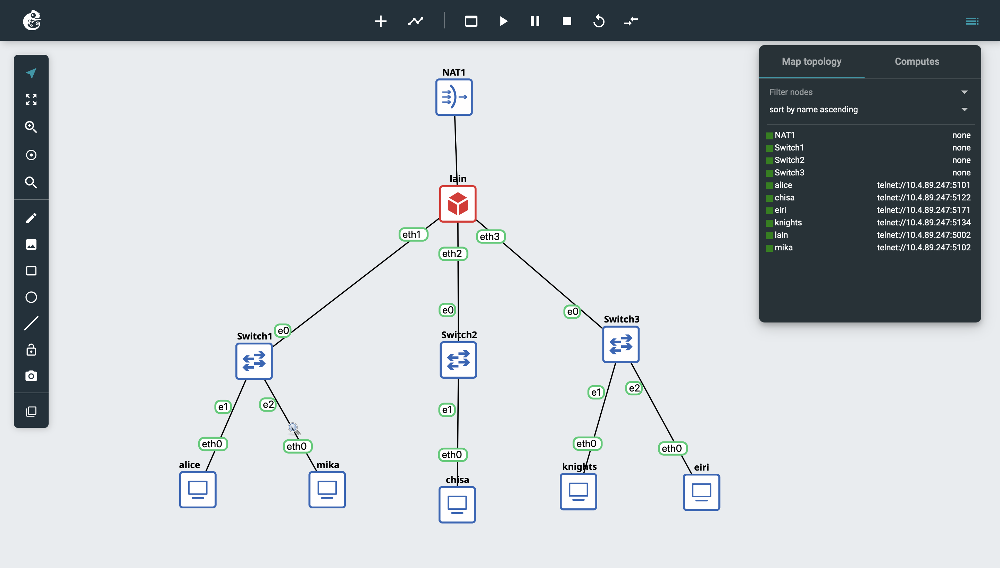

---

### Soal 2

Soal 2 minta router Lain terhubung ke internet publik lewat NAT/DHCP di interface eth0, karena The Wired pada saat itu masih terisolasi dari dunia luar.

```sh
auto eth0
iface eth0 inet dhcp
```

eth0 dibiarkan mendapat IP otomatis dari DHCP jaringan luar, sehingga router langsung punya akses internet tanpa perlu setting IP manual.

#### Output

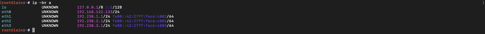

---

### Soal 3

Pada soal 3, seluruh Entitas (Client) di bawah Switch 1, Switch 2, dan Switch 3 harus bisa saling terhubung dan berkomunikasi satu sama lain melalui konfigurasi routing.

Karena router Lain terhubung langsung ke ketiga subnet lewat eth1, eth2, dan eth3, routing antar subnet sudah terbentuk otomatis dari routing table router tanpa perlu tambahan konfigurasi khusus. Pembuktiannya dilakukan dengan ping ke IP Address Entitas di subnet lain:

```sh
ping -c 2 <IP_tujuan>
```

#### Output

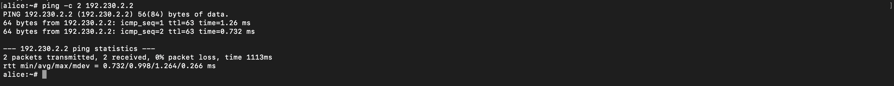

#### Revisi

Saat mencoba melakukan ping dari Alice ke IP address Eiri (192.230.3.2) yang berada di subnet lain, ping gagal. Hal ini terjadi karena adanya kesalahan konfigurasi pada client Eiri, yaitu belum ditambahkannya konfigurasi auto eth0.

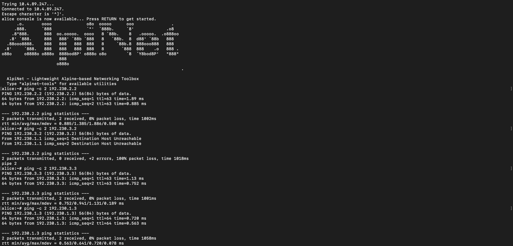

Setelah dilakukan revisi dengan menambahkan auto eth0 pada konfigurasi Eiri, ping dari Alice ke Eiri (192.230.3.2) berhasil. Ini membuktikan bahwa masalah sebelumnya memang berasal dari konfigurasi interface Eiri, bukan dari routing atau router.

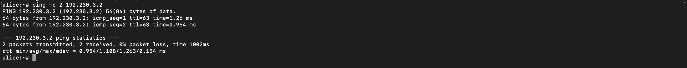

Hal yang sama juga berlaku apabila ping dilakukan dari client lain. Setelah eth0 pada Eiri dikonfigurasi, client lain seperti Chisa ataupun yang lainnya juga dapat melakukan ping ke Eiri (192.230.3.2) dengan berhasil.

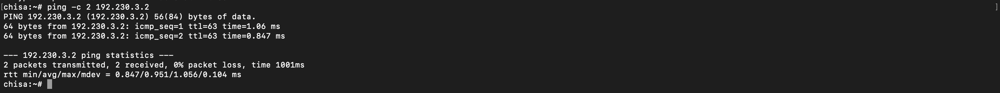

---

### Soal 4

Pada soal 4, tiap Entitas (Client) diminta punya kemandirian di The Wired, yaitu bisa ping ke 8.8.8.8 dan membuka domain google.com, lewat konfigurasi firewall/iptables NAT Masquerade dan DNS resolver.

Langkah pertama, buat file `/root/router.sh` di router Lain berisi command NAT dan forwarding:

```sh
sysctl -w net.ipv4.ip_forward=1
iptables -t nat -A POSTROUTING -o eth0 -j MASQUERADE
iptables -A FORWARD -i eth1 -o eth0 -j ACCEPT
iptables -A FORWARD -i eth2 -o eth0 -j ACCEPT
iptables -A FORWARD -i eth3 -o eth0 -j ACCEPT
```

```sh
chmod +x router.sh
./router.sh
```

Baris `sysctl -w net.ipv4.ip_forward=1` mengaktifkan IP forwarding di kernel, supaya router mau meneruskan paket dari satu interface ke interface lain. Ini yang mendasari routing antar-subnet (soal 3) dan NAT (soal 4).

`MASQUERADE` di tabel `nat` bertugas nge-rewrite source IP private client (192.230.x.x) menjadi IP publik router saat paket keluar lewat eth0, supaya balasan dari internet bisa kembali ke router dan di-translate ulang ke client yang benar. Tanpa ini, client dengan IP private tidak bisa langsung berkomunikasi dengan server di internet.

`FORWARD` mengatur izin apakah sebuah paket boleh diteruskan dari satu interface ke interface lain di router. Default policy `FORWARD` di banyak sistem adalah `ACCEPT`, makanya soal 3 tadi bisa langsung jalan tanpa rule tambahan. Tiga baris `ACCEPT` ditambahkan untuk memastikan secara eksplisit trafik dari eth1, eth2, dan eth3 menuju eth0 (internet) diizinkan lewat. Rule ini hanya mengatur arah keluar, sedangkan paket balasan dari internet tetap diteruskan karena policy `FORWARD` masih `ACCEPT`. Kalau policy diubah menjadi `DROP`, arah baliknya juga perlu diizinkan, misalnya dengan `iptables -A FORWARD -m state --state RELATED,ESTABLISHED -j ACCEPT`.

Untuk DNS resolver, tiap client diset otomatis saat interface naik, contoh di Eiri:

```sh
auto eth0
iface eth0 inet static
address 192.230.3.2
netmask 255.255.255.0
gateway 192.230.3.1
up echo "nameserver 8.8.8.8" > /etc/resolv.conf
```

`8.8.8.8` adalah alamat Google Public DNS, dipakai supaya client bisa menerjemahkan nama domain (google.com) menjadi IP address. Tanpa ini client hanya bisa akses internet pakai IP langsung, tidak bisa membuka website lewat nama domainnya.

Baris `up echo "nameserver 8.8.8.8" > /etc/resolv.conf` adalah bagian dari `/etc/network/interfaces`, bukan file terpisah. `up` artinya command yang dijalankan otomatis tiap kali interface eth0 naik. Isi command-nya menulis ke `/etc/resolv.conf`, file khusus yang menyimpan daftar DNS server yang dipakai sistem untuk resolve domain (terpisah dari `/etc/network/interfaces` yang isinya konfigurasi IP address dan routing interface). Jadi tidak perlu edit manual `/etc/resolv.conf` di terminal, cukup taruh baris `up echo ...` itu di dalam `/etc/network/interfaces` (edit pakai `nano /etc/network/interfaces`), dan tiap kali eth0 up, `/etc/resolv.conf` otomatis ter-generate ulang. Cara yang sama diterapkan ke Alice, Mika, Chisa, dan Knights.

#### Output

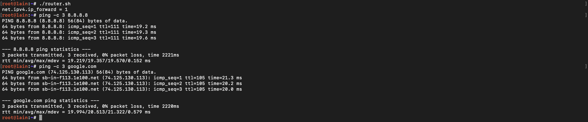

---

### Soal 5

Eiri tetap berupaya menanamkan kekacauan ke dalam jaringan, sehingga untuk mengantisipasi restart tiba-tiba, pada soal 5 diminta membuat script verifikasi `/root/cek_status.sh` di router Lain yang menampilkan ringkasan interface (`ip -br a`) dan status tabel NAT (`iptables -t nat -L -v -n`) setelah reboot.

```sh
nano /root/cek_status.sh
```

Isi `cek_status.sh`:

```sh
#!/bin/bash
ip -br a
iptables -t nat -L -v -n
```

```sh
chmod +x /root/cek_status.sh
```

Script `router.sh` dari soal 4 dan `cek_status.sh` ditaruh di `init.sh` supaya otomatis jalan tiap kali router boot atau di-restart:

```sh
/root/router.sh
/root/cek_status.sh
```

Jadi begitu router Lain nyala ulang, `router.sh` langsung menerapkan ulang aturan NAT dan forwarding, sedangkan `cek_status.sh` langsung menampilkan ringkasan interface dan status tabel NAT untuk memastikan konfigurasi tidak hilang, tanpa perlu dicek manual satu per satu — sehingga upaya Eiri menanamkan kekacauan lewat restart mendadak tidak berhasil mengganggu konfigurasi jaringan.

#### Output

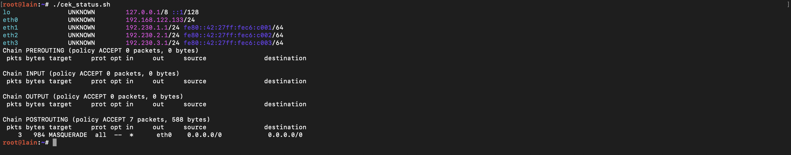

---

### Soal 6

Mika mencurigai adanya anomali traffic pada segmen jaringannya. Pada soal 6 diminta menjalankan traffic generator di node Mika, lalu sniffing pakai Wireshark dengan display filter khusus untuk paket DNS atau ICMP.

File generator diunduh dari link yang diberikan, isinya disalin ke node Mika sebagai `traffic_protocol7.sh`:

```sh
nano traffic_protocol7.sh
```

```sh
#!/bin/bash
# ============================================
# Traffic Generator — Protocol 7 Network
# Serial Experiments Lain — Modul 1 Jarkom 2026
# Jalankan di node MIKA untuk generate traffic DNS & ICMP
# ============================================

echo "============================================"
echo "  Protocol 7 Traffic Generator v2026"
echo "  Node: Mika Iwakura"
echo "============================================"
echo "[*] Generating DNS & ICMP traffic..."

# ICMP Traffic
ping -c 5 8.8.8.8 &
ping -c 5 1.1.1.1 &
ping -c 3 its.ac.id &

# DNS Queries
nslookup google.com 8.8.8.8 &
nslookup its.ac.id 8.8.8.8 &
nslookup github.com 1.1.1.1 &
dig @8.8.8.8 example.com A &
dig @1.1.1.1 cloudflare.com AAAA &

wait
echo "[*] Traffic generation complete."
echo "[*] Check Wireshark for captured packets."
```

```sh
chmod +x traffic_protocol7.sh
```

Script ini generate dua jenis traffic sekaligus secara paralel (pakai `&`): ICMP lewat `ping` ke beberapa target (8.8.8.8, 1.1.1.1, its.ac.id), dan DNS query lewat `nslookup` dan `dig` ke beberapa domain. Baris `wait` di akhir memastikan script menunggu semua proses background selesai dulu sebelum menampilkan pesan selesai.

Sebelum script dijalankan, capture Wireshark di interface node Mika distart dulu, baru script dieksekusi:

```sh
./traffic_protocol7.sh
```

Setelah traffic terekam, di Wireshark diterapkan display filter:

```
dns or icmp
```

Dari hasil filter, terlihat paket-paket DNS query/response ke domain-domain yang di-query dan paket ICMP Echo Request/Reply ke target-target yang di-ping, sesuai skenario anomali traffic yang dicurigai Mika.

#### Output

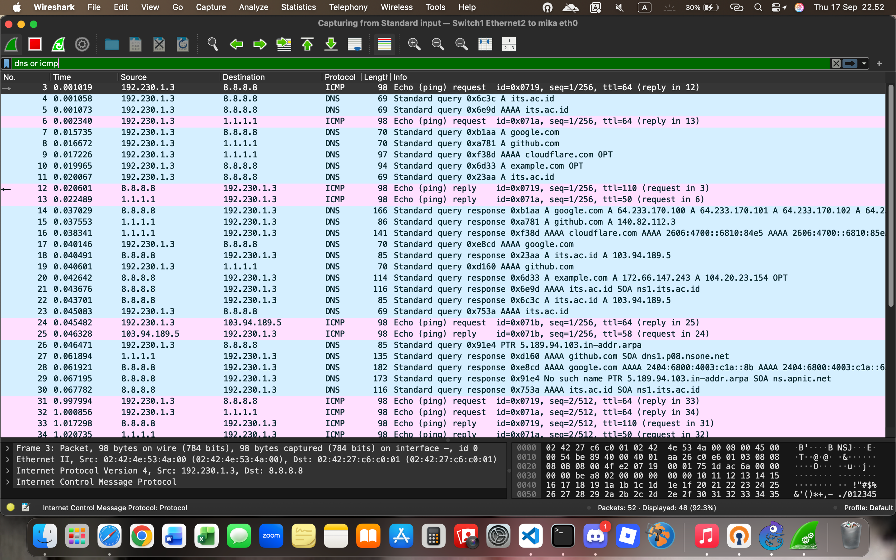

#### Analisis

Capture pada link _Switch1 Ethernet2 ke mika eth0_ dengan filter `dns or icmp` menampilkan dua jenis traffic dari Mika (`192.230.1.3`). Dari **52 paket** yang tertangkap, **48 paket (92,3%)** lolos filter, sedangkan 4 paket sisanya bukan DNS/ICMP. **ICMP (Internet Control Message Protocol)** adalah protokol **layer jaringan** yang dipakai untuk diagnostik dan pelaporan error, dan dibawa langsung di atas IP **tanpa port**. Pada capture, ICMP muncul sebagai _Echo (ping) request_ ke `8.8.8.8`, `1.1.1.1`, dan `103.94.189.5` (IP its.ac.id) yang masing-masing dibalas _Echo (ping) reply_. Detail frame 3 hanya berisi lapisan Ethernet, IPv4, dan ICMP, **tanpa UDP/TCP**. **DNS (Domain Name System)** adalah protokol **layer aplikasi** yang menerjemahkan nama domain menjadi alamat IP dan berjalan di atas **UDP port 53**. Pada capture, DNS muncul sebagai _Standard query_ tipe A dan AAAA ke `8.8.8.8` dan `1.1.1.1` untuk google.com, github.com, its.ac.id, example.com, dan cloudflare.com, lalu dijawab _Standard query response_ berisi alamat IP.

Kedua jenis traffic ini muncul dalam jumlah banyak dan waktu yang sangat singkat karena dibangkitkan oleh `traffic_protocol7.sh`, sehingga terlihat sebagai **anomali traffic** di segmen Mika.

---

### Soal 7

Chisa memutuskan mendirikan FTP Server pada node miliknya dengan shared folder `/var/wired/data`. Kebijakan aksesnya: user alice (read & write), user mika (dibatasi read-only), user eiri (tanpa izin akses sama sekali / blacklist).

Bikin folder shared dulu:

```sh
mkdir -p /var/wired/data
chown root:root /var/wired/data
```

Bikin 3 user OS yang jadi akun FTP:

```sh
adduser alice
adduser mika
adduser eiri
```

`adduser` akan meminta password untuk tiap user, isi saat diminta karena login FTP membutuhkan password.

Install tools yang dibutuhkan, termasuk `shadow` supaya `usermod` bisa dipakai:

```sh
apk update
apk add shadow
apk add vsftpd
```

Bikin grup akses khusus, alice dan mika dimasukkan ke grup ini:

```sh
addgroup ftpaccess
adduser alice ftpaccess
adduser mika ftpaccess
```

Arahkan home directory ketiga user ke folder shared:

```sh
usermod -d /var/wired/data alice
usermod -d /var/wired/data mika
usermod -d /var/wired/data eiri
```

```sh
chown root:ftpaccess /var/wired/data
chmod 770 /var/wired/data
```

Whitelist alice dan mika di userlist, otomatis eiri ter-blacklist karena tidak masuk daftar:

```sh
echo -e "alice\nmika" > /etc/vsftpd.userlist
```

Setting read-only khusus buat mika:

```sh
mkdir -p /etc/vsftpd/user_conf
echo "write_enable=NO" > /etc/vsftpd/user_conf/mika
```

Ganti isi file config bawaan `/etc/vsftpd/vsftpd.conf` dengan:

```sh
listen=YES
anonymous_enable=NO
local_enable=YES
write_enable=YES
local_root=/var/wired/data
userlist_enable=YES
userlist_file=/etc/vsftpd.userlist
userlist_deny=NO
user_config_dir=/etc/vsftpd/user_conf
seccomp_sandbox=NO
pam_service_name=vsftpd
pasv_enable=YES
pasv_min_port=30000
pasv_max_port=30100
file_open_mode=0666
local_umask=002
```

Jalankan servernya:

```sh
vsftpd /etc/vsftpd/vsftpd.conf &
```

**Pembuktian read & write alice** — buat file `signal_alice.txt` lalu login FTP pakai akun alice untuk upload:

```sh
nano signal_alice.txt
# isi file
lftp alice@192.230.2.2
put signal_alice.txt
```

**Pembuktian penolakan akses eiri**:

```sh
lftp eiri@192.230.2.2
```

Login eiri ditolak server dengan pesan `530 Permission denied.` karena `eiri` tidak ada di `/etc/vsftpd.userlist` sedangkan `userlist_deny=NO` (artinya hanya user yang ada di file itu yang diizinkan login), sehingga eiri otomatis diblokir tanpa perlu rule tambahan.

Hasil testing pakai lftp menunjukkan user alice bisa melakukan put, get, dan ls karena punya akses penuh, user mika bisa get tapi gagal put karena `write_enable=NO`, sedangkan user eiri gagal login sama sekali sehingga semua command tidak bisa dijalankan.

#### Output

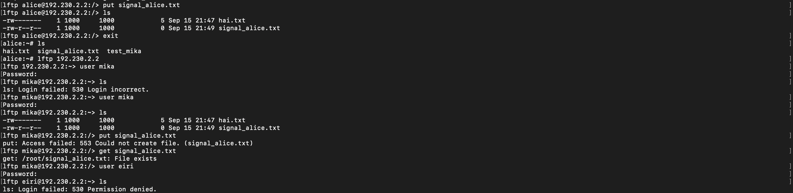

---

### Soal 8

Kelompok rahasia Knights perlu mengirim dokumen laporan intelijen ke FTP Server Chisa. Soal 8 minta Knights melakukan koneksi FTP dari node Knights ke server Chisa memakai akun alice untuk upload dokumen, lalu dianalisis di Wireshark: perintah STOR, status 226, dan port data PASV.

```sh
nano knights_report.txt
# isi file laporan intelijen, copas dari drive
lftp alice@192.230.2.2
put knights_report.txt
```

Capture Wireshark diambil pada link _Switch3 Ethernet1 ke knights eth0_ tanpa display filter, sehingga seluruh sesi (56 paket) terlihat pada dua screenshot di bagian Output. Hasil analisis sesinya:

- Login: `USER alice` → `331 Please specify the password.` → `PASS ...` → `230 Login successful.` (username dan password terlihat jelas karena FTP tidak terenkripsi)
- Direktori kerja: `PWD` → `257 "/var/wired/data" is the current directory`, sesuai shared folder di soal 7.
- Mode binary: `TYPE I` → `200 Switching to Binary mode.`
- Negosiasi PASV: request `PASV` (frame 34) → response `227 Entering Passive Mode (192,230,2,2,117,143)` (frame 35), artinya port data = 117×256+143 = **30095** (masuk range `pasv_min_port`-`pasv_max_port` 30000-30100 yang sudah diset di vsftpd.conf). Koneksi data terlihat dari handshake TCP Knights (port 53080) ke Chisa port 30095 (frame 36-38).
- Upload: `STOR knights_report.txt` (frame 39) → `150 Ok to send data.` (frame 40) → data 1111 bytes lewat port 30095, sama dengan ukuran file (frame 41) → `226 Transfer complete.` (frame 46)

Dua respons `500 Unknown SITE command` setelah `226` berasal dari lftp yang mencoba mengatur waktu file (`SITE UTIME`), yang tidak didukung vsftpd. Ini tidak memengaruhi keberhasilan upload.

Jawaban soal: perintah FTP untuk upload adalah **`STOR`**, kode status sukses server adalah **`226`**, dan port data TCP yang dinegosiasikan pada mode PASV adalah **`30095`**.

#### Output

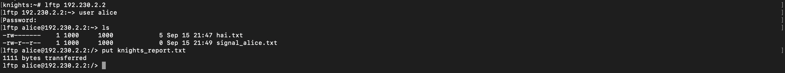

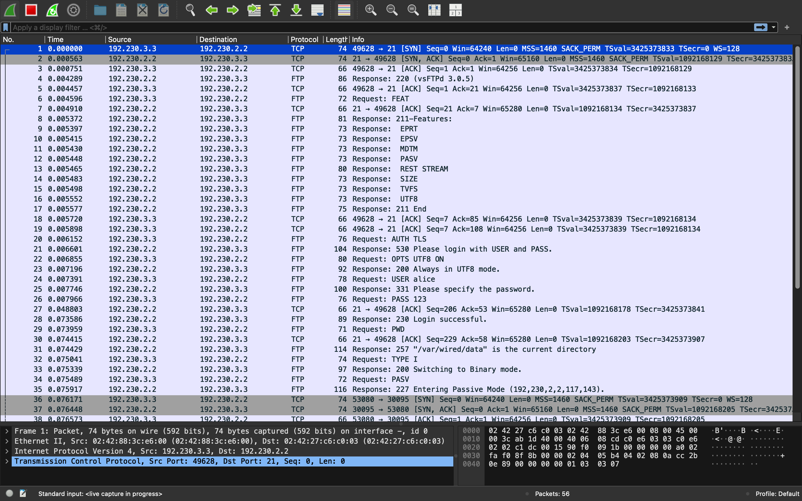

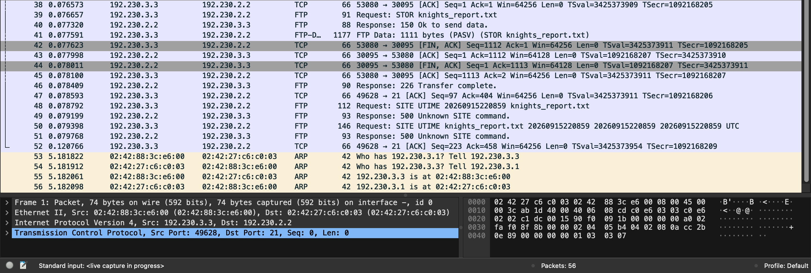

---

### Soal 9

Mika mengakses dokumen Protokol Tujuh dari FTP Server Chisa. Soal 9 minta Mika mendownload `protocol7_manifesto.txt` memakai akun mika, lalu membuktikan pembatasan read-only-nya dengan mencoba upload file baru.

File `protocol7_manifesto.txt` (dari link drive) sebelumnya sudah ditaruh di `/var/wired/data` pada Chisa oleh root, sehingga bisa diakses lewat FTP Server.

```text
lftp mika@192.230.2.2
lftp mika@192.230.2.2:~> ls
lftp mika@192.230.2.2:~> get protocol7_manifesto.txt
1738 bytes transferred
lftp mika@192.230.2.2:~> put protocol7_manifesto.txt
put: Access failed: 550 Permission denied. (protocol7_manifesto.txt)
```

Terbukti mika bisa `get` file `protocol7_manifesto.txt` dengan sukses, tapi kena `550 Permission denied` saat mencoba `put`, sesuai `write_enable=NO` yang khusus diset untuk user mika di soal 7.

#### Output

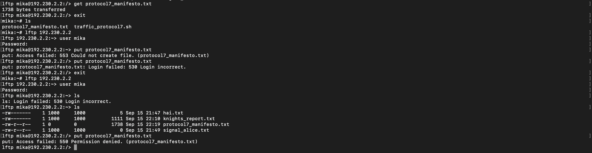

---

### Soal 10

Knights melancarkan uji ketahanan koneksi ke server Chisa untuk menguji latensi jaringan The Wired. Soal 10 minta Knights ping ke Chisa dengan payload 128 byte, interval 0.3 detik, sebanyak 77 paket.

```sh
ping -c 77 -s 128 -i 0.3 192.230.2.2
```

Di Wireshark, tiap Echo Request (ICMP Type 8, Code 0) dibalas Echo Reply (ICMP Type 0, Code 0) dengan `id` dan `seq` yang sama. Ukuran tiap frame 170 byte (128 byte payload + 8 byte header ICMP + 20 byte header IP + 14 byte header Ethernet), sesuai opsi `-s 128`. TTL Echo Request bernilai 64 (TTL awal dari Knights), sedangkan TTL Echo Reply bernilai 63 karena balasan dari Chisa sudah melewati satu router (Lain) sebelum sampai ke Knights (capture diambil di sisi Knights).

Hasil statistik ping:

- Packets transmitted: 77, received: 77, packet loss: **0%**
- RTT min/avg/max/mdev = **0.402 / 0.562 / 1.299 / 0.154 ms** (total waktu 25667 ms)

Tidak ada packet loss dan RTT stabil, artinya koneksi The Wired antara Knights dan Chisa berjalan lancar tanpa gangguan meski dikirim payload lebih besar dan interval rapat.

#### Output

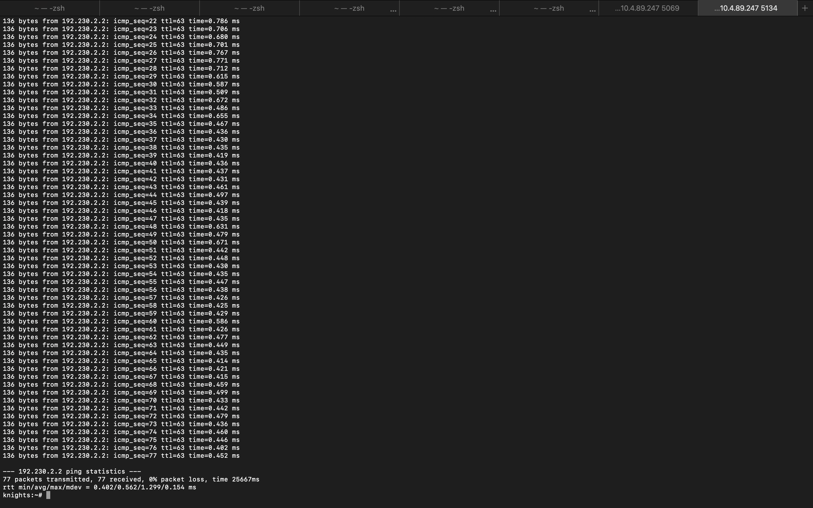
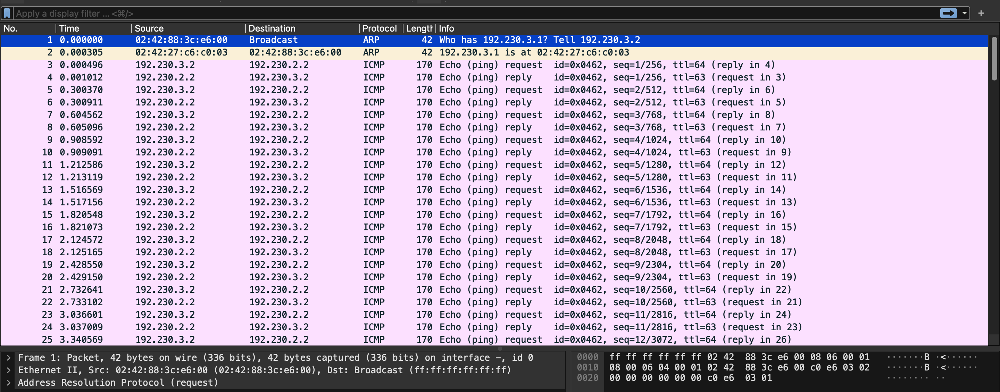

---

### Kendala saat mengerjakan

- Kesusahan saat mengkonfigurasi nomor 7
- Lupa mencatat dan ss setiap langkah dan soal yang dikerjakan
- Terdapat kekeliruan pada konfigurasi Eiri, yaitu belum ditambahkannya `auto eth0` (kemungkinan lupa ditambahkan atau terhapus)

<br/>

##### Soal 11

Buktikan kelemahan protokol Telnet dengan membuat akun phantom_user dan password wired_ghost pada layanan telnetd di node Chisa. Lakukan login Telnet dari node Eiri ke node Chisa dan tangkap sesi menggunakan Wireshark. Tunjukkan kredensial plain text melalui fitur Follow TCP Stream, serta jelaskan mengapa setiap karakter terkirim dalam paket TCP terpisah. <br/><br/>

Menambahkan user phantom user di node chisa <br/>
<br/>
Setup telnet <br/>
<br/>
Menjalankan telnet di node <br/>
<br/><br/>

Kredensial Plain Text: <br/>

```bash
chisa login:
p
p
han
han
t
t
o
o
m
m
_
_
u
u
s
s
e
e
r
r


Password:
wired_ghost
```

Karakter yang terkirim dalam paket TCP terpisah karena sesi konsol jarak jauh (seperti Telnet atau SSH) beroperasi dalam Character Mode (Mode Karakter) atau mode interaktif. <br/><br/>

#### Revisi

Ternyata IP node eiri tertukar dengan node knights <br/>
Tukar dengan mengedit /etc/network/interfaces<br/>
Node eiri<br/>
<br/>
Node knights<br/>
<br/>
Setelah mengedit interfaces, jalankan ini di kedua node tersebut<br/>

```bash
ifdown eth0
ifup eth0
```

<br/><br/>

#### Soal 12

Alice mencurigai Knights menjalankan beberapa layanan rahasia di node-nya. Lakukan pemindaian port dari node Alice ke node Knights menggunakan Netcat (nc) untuk memeriksa port 22 (SSH) dan 80 (HTTP) dalam keadaan terbuka, serta port rahasia 7777 dalam keadaan tertutup. Analisis di Wireshark perbedaan TCP Flag yang dikembalikan antara port terbuka (SYN-ACK) dengan port tertutup (RST-ACK).<br/><br/>

Menyalakan port 22 dan 80 di node knights <br/>
<br/>
<br/><br/>

Cek IP node knights menggunakan, <br/>

```bash
ip a
```

Scanning port 22, 80, & 7777 node knights di node alice, buka wireshark sebelum scanning<br/>
<br/><br/>

Hasil scan port <br/>
<br/>
<br/>
<br/><br/>

| Port | Status | Paket 1 (Alice->Knights) | Paket 2 (Alice->Knights) | Lanjut |
| ---- | ------ | ------------------------ | ------------------------ | ------ |
| 22   | Open   | SYN                      | SYN,ACK                  | Ya     |
| 80   | Open   | SYN                      | SYN,ACK                  | Ya     |
| 7777 | Closed | SYN                      | RST,ACK                  | Tidak  |

<br/><br/>

#### Soal 13

Lain memerintahkan agar administrasi jarak jauh menggunakan SSH
secara aman tanpa password. Install OpenSSH server pada node Knights, buat pasangan kunci SSH (ssh-keygen) pada node Mika untuk user mika_admin, dan konfigurasikan public key authentication (PasswordAuthentication no). Lakukan koneksi SSH dari node Mika ke node Knights, tangkap sesi menggunakan Wireshark, identifikasi paket Protocol Version Exchange dan Key Exchange, serta jelaskan mengapa kredensial tidak terlihat dalam bentuk teks terbuka seperti pada Telnet.
kredensial tidak terlihat jareba SSH menggunakan enkirpsi berbeda dengan Telnet yang dikirim tanpa enkripsi.<br/><br/>

Setup SSH di node knights<br/>
<br/>
Generate SSH Key dan cek apakah sudah nyala<br/>
<br/>
Menambah user<br/>
<br/>
Verifikasi user tidak locked<br/>
<br/>
Memasang public key<br/>
<br/>
<br/>
<br/>
Masukkan SSH-RSA ke /home/mika_admin/.sshauthorized_keys<br/>
<br/>
<br/>
Hapus "#" di<br/>

```bash
PubkeyAuthentication yes
PasswordAuthentication no
```

Menjalankan SSHD<br/>
<br/>
Buka wireshark untuk menangkap sesi lalu login dari node mika<br/>
<br/><br/>

<br/>
Kredensial tidak terlihat jareba SSH menggunakan enkirpsi berbeda dengan Telnet yang dikirim tanpa enkripsi. <br/><br/>

#### Revisi

Tidak ada, sudah bisa berjalan dengan revisi No 12

<br/><br/>

#### Soal 14

Setelah gagal mengakses FTP, Eiri melancarkan serangan brute-force terhadap form login web Alice. Analisis file capture wired_bruteforce.pcapng untuk mengidentifikasi alamat IP penyerang, target IP beserta port yang diserang, password user lain_admin yang berhasil ditembus, serta web server software dan versi yang dilaporkan pada response header. Validasi temuan kalian pada socket server:
<br/><br/>

Cek traffic HTTP<br/>
<br/>
Cek percobaan Login dan IP Destination nya 172.26.7.100<br/>
<br/>
Cek paket response<br/>
<br/>
Klik salah satu paket lalu Follow->HTTP Stream<br/>

```bash
POST /login.php HTTP/1.1
Host: 172.26.7.100:8080
User-Agent: Fuzz Faster U Fool v2.1.0-dev
Content-Type: application/x-www-form-urlencoded
Content-Length: 45

username=lain_admin&password=wired_pr0tocol_7
HTTP/1.1 200 OK
Server: Apache/2.4.62
Content-Type: text/html; charset=UTF-8
Content-Length: 35
X-Powered-By: PHP/8.3.14

<h1>Success! Login successful.</h1>
```

Ip penyerang: 172.26.7.50 <br/>
Ip target: 172.26.7.100 <br/>
Port target:8080 <br/>
Username: lain_admin <br/>
Password: wired_pr0tocol_7 <br/>
Web server: Apache <br/>
Versi apache: 2.4.62 <br/>
PHP: 8.3.14 <br/>

#### Revisi

<br/><br/>

#### Soal 15

Eiri menyusup ke ruang server dan memasang perangkat keyboard USB berbahaya pada node Alice. Buka file capture wired_usb_hid.pcap, identifikasi Vendor ID dan Product ID perangkat USB dari deskriptor USB, alamat nomor device USB, serta pesan rahasia yang berhasil dicuri dari keystroke.<br/><br/>

Cari deskriptor device<br/>
<br/>
Klik salah satu packet dan cari USB Device Descriptor<br/>
<br/>
Vendor ID: 0x046D (Logitech, Inc.)<br/>
Product ID: 0xC31C (Keyboard K120)<br/><br/>
Cari alamat nomor device USB<br/>
<br/>
Isolasi traffic interrupt<br/>
<br/>
Ambil payload data<br/>
<br/>
Klik salah satu packet dan lihat<br/>
<br/>
Bisa ditemukan ada pola di Leftover Capture Data<br/><br/>

Buka terminal/vscode di folder tempat file .pcap nya<br/>
Buat decoder menggunakan python<br/>

```bash
PS C:\Users\Farrel\Downloads> & "C:\Program Files\Wireshark\tshark.exe" -r soal15_wired_usb_hid.pcap -Y "usb.capdata" -T fields -e usb.capdata | Out-File -Encoding ASCII hid_data.txt
PS C:\Users\Farrel\Downloads> notepad decode.py
```

buat decode.py <br/>

```bash
keyboard_map = {
    0x04: ('a', 'A'), 0x05: ('b', 'B'), 0x06: ('c', 'C'), 0x07: ('d', 'D'), 0x08: ('e', 'E'),
    0x09: ('f', 'F'), 0x0a: ('g', 'G'), 0x0b: ('h', 'H'), 0x0c: ('i', 'I'), 0x0d: ('j', 'J'),
    0x0e: ('k', 'K'), 0x0f: ('l', 'L'), 0x10: ('m', 'M'), 0x11: ('n', 'N'), 0x12: ('o', 'O'),
    0x13: ('p', 'P'), 0x14: ('q', 'Q'), 0x15: ('r', 'R'), 0x16: ('s', 'S'), 0x17: ('t', 'T'),
    0x18: ('u', 'U'), 0x19: ('v', 'V'), 0x1a: ('w', 'W'), 0x1b: ('x', 'X'), 0x1c: ('y', 'Y'),
    0x1d: ('z', 'Z'), 0x1e: ('1', '!'), 0x1f: ('2', '@'), 0x20: ('3', '#'), 0x21: ('4', '$'),
    0x22: ('5', '%'), 0x23: ('6', '^'), 0x24: ('7', '&'), 0x25: ('8', '*'), 0x26: ('9', '('),
    0x27: ('0', ')'), 0x28: ('\n', '\n'), 0x2a: ('[BACKSPACE]', '[BACKSPACE]'), 0x2b: ('\t', '\t'),
    0x2c: (' ', ' '), 0x2d: ('-', '_'), 0x2e: ('=', '+'), 0x2f: ('[', '{'), 0x30: (']', '}'),
    0x31: ('\\', '|'), 0x33: (';', ':'), 0x34: ('\'', '"'), 0x35: ('`', '~'), 0x36: (',', '<'),
    0x37: ('.', '>'), 0x38: ('/', '?')
}

try:
    with open("hid_data.txt", "r") as f:
        lines = f.readlines()

    output = ""
    for line in lines:
        line = line.strip()
        # Mengabaikan baris kosong atau format yang tidak sesuai
        if not line or len(line) < 16:
            continue

        # Ekstrak Modifier (Byte 1) dan Keycode (Byte 3)
        modifier = int(line[0:2], 16)
        keycode = int(line[4:6], 16)

        # Skip jika tidak ada tombol ditekan (00)
        if keycode == 0:
            continue

        # Cek apakah Left Shift (02) atau Right Shift (20) sedang ditekan
        is_shift = (modifier == 0x02) or (modifier == 0x20)

        if keycode in keyboard_map:
            # Memilih index 0 untuk lowercase, index 1 untuk uppercase
            output += keyboard_map[keycode][1 if is_shift else 0]

    print("\nHasil Decode:\n")
    print(output)
    print("\n")

except FileNotFoundError:
    print("Error: File hid_data.txt tidak ditemukan. Pastikan file ada di folder yang sama.")
```

buka lagi terminal<br/>
<br/>
Ditemukan pesan rahasianya.<br/>

# Revisi

<br/><br/>

#### Soal 16

Eiri meletakkan file malware di server. Dari file capture wired_ftp_theft.pcap, lakukan analisis lalu lintas FTP untuk mengidentifikasi alamat IP server FTP penyerang, banner software FTP yang digunakan, kredensial login penyerang, serta ukuran (size in bytes) dari file malware knights_payload.exe yang diunduh.<br/><br/>

Isolasi traffic FTP<br/>
<br/>
Buka Statistic->Conversation->TCP<br/>
<br/>
Mengambil IP yang paling mencurigakan & isolasi berdasarkan IP tersebut<br/>
<br/>
Cek banner tiap server
<br/>
Mencari kredensial login<br/>
<br/>
Mencari nama file yang terlibat<br/>
<br/>
Mencari ukuran file yang terlibat<br/>
<br/>
IP Penyerang: 198.51.100.7 <br/>
Banner software: vsftpd 3.0.5 <br/>
Kredensial login penyerang: USER: knights_agent / PASS: N4v1_s3cur3_2026 <br/>
Ukuran file: 524288 bytes <br/><br/>

#### Revisi

<br/><br/>

#### Soal 17

Alice membuat halaman web di node-nya. Eiri memanfaatkan celah untuk mengunduh payload berbahaya ke sistem Alice. Analisis file capture wired_http_c2.pcap untuk mengidentifikasi nama domain (Host) tempat malware diunduh, alamat IP server penyerang, nama file executable malware yang diunduh, serta kode status HTTP yang dikembalikan. <br/><br/>

Isolasi traffic HTTP<br/>
<br/>
Cari request "GET"<br/>
<br/>
Cari header Host di tiap request<br/>
<br/>
Cari request yang mengunduh file .exe<br/>
<br/>
IP pengirim: 203.0.113.42 <br/>
IP penerima: 10.7.113.42 <br/>
Folder tujuan: /navi_agent.exe <br/>
Kode status: 200 <br/><br/>

#### Revisi

<br/><br/>

#### Soal 18

Eiri mengubah taktik penyerangan dengan menanamkan file malware menggunakan protokol file sharing SMB. Analisis file capture wired_smb_transfer.pcapng untuk mengidentifikasi nama protokol jaringan yang dieksploitasi, IP pengirim dan penerima, folder tujuan penyimpanan malware pada sistem korban, serta nama file executable malware yang ditransfer. <br/><br/>

Cek protokol yang dipakai di port 445<br/>
<br/>
Isolasi traffic protokol SMB2
<br/>
Cari nama file yang ditransfer<br/>
<br/>
Protokol Jaringan: SMB2 <br/>
IP pengirim: 10.7.1.100 <br/>
IP penerima: 10.7.1.50 <br/>
Folder tujuan: System32 <br/>
Nama file executable: wired_trojan_payload.exe <br/><br/>

#### Revisi

<br/<br/>

#### Soal 19

Eiri meneror jaringan dengan mengirimkan email pemerasan melalui protokol SMTP tanpa enkripsi. Analisis file capture wired_smtp_threat.pcap pada stream TCP terkait, identifikasi alamat email korban yang ditargetkan, password korban yang diklaim bocor oleh penyerang, jenis malware yang diinfeksikan, batas waktu (dalam hari) yang diberikan, serta MailClientID yang tercantum pada pesan. <br/><br/>

Cek traffic SMTP<br/>
<br/>
Buka Statistic->Conversation->TCP<br/>
Mengambil IP yang paling mencurigakan & isolasi berdasarkan IP tersebut<br/>
<br/>
ip.addr == 185.234.72.19 && ip.addr == 203.0.113.100 && smtp <br/>
<br/>
Didapatkan:<br/>
Email korban: victim@protocol7.co.jp<br/>
Pass korban: pr0tocol_7_user<br/>
Jenis malware: Ransomware<br/>
Batas waktu: 72 hours (3 dyas)<br/>
MailClientID: 7719980706<br/><br/>

#### Revisi

<br/><br/>

#### Soal 20

Untuk rencana pamungkasnya, Eiri menyembunyikan komunikasi malware di balik saluran terenkripsi TLS. Namun Alice telah menyediakan file keylog untuk mendekripsi lalu lintas data tersebut. Analisis file capture wired_tls_decrypt.pcapng bersama keyslogfile.txt untuk mengidentifikasi versi protokol TLS yang dinegosiasikan, nama domain (SNI) yang diakses, alamat IP server HTTPS penyerang, User-Agent yang digunakan, serta HTTP request method dan path yang tersembunyi di dalam sesi dekripsi. <br/><br/>

Cari SNI<br/>
<br/>
<br/>
Isolasi Application Data<br/>
<br/>
Cek versi TLS<br/>
<br/>
Verifikasi Cipher Suite<br/>
<br/>
Cek ekstensi ALPN<br/>
<br/>
Isolasi record APplication Data & cek tab Decrypted TLS<br/>
<br/>
Isolasi request HTTP<br/>
<br/><br/>
Didapatkan<br/>

| Temuan      | Teridentifikasi  |
| ----------- | ---------------- |
| Versi TLS   | TLS 1.2 (0x0303) |
| SNI/Domain  | `example.com`    |
| IP Server   | `93.184.216.34`  |
| User-Agent  | `curl/7.62.0`    |
| HTTP Method | `HEAD`           |
| HTTP Path   | `HEAD /`         |

<br/><br/>

#### Revisi


